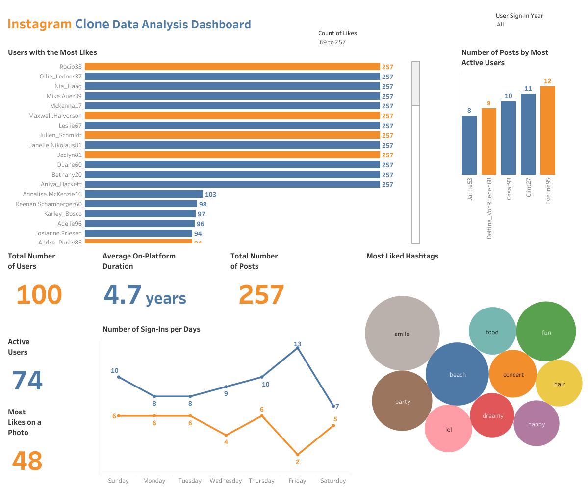
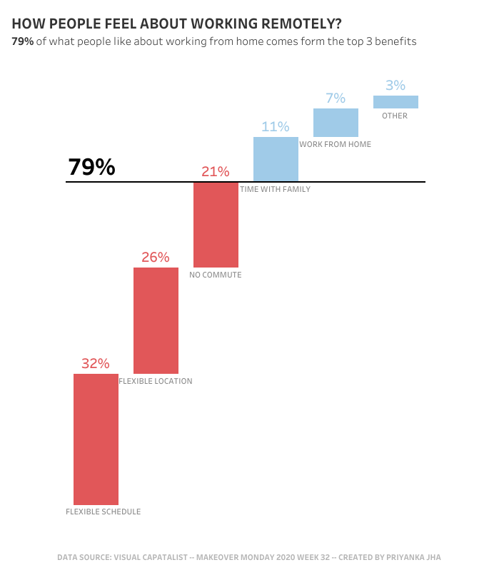
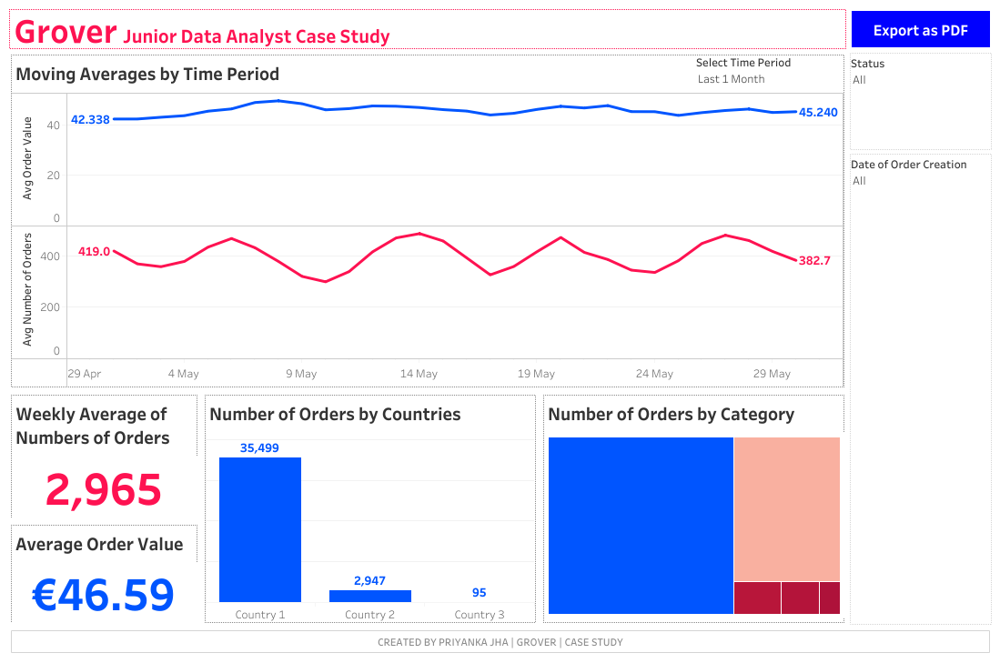
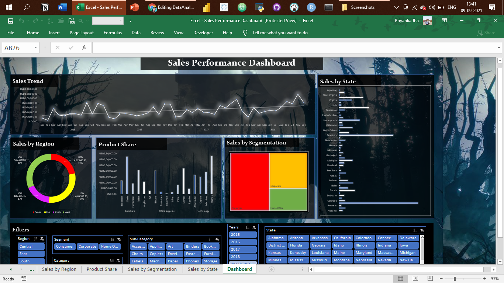
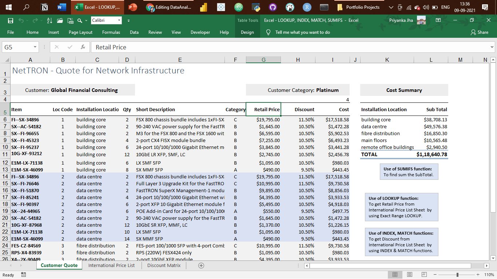
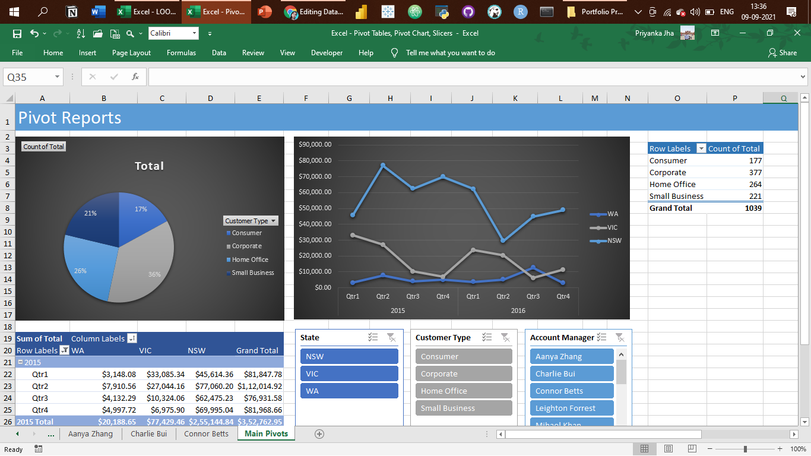

# Personal Projects
## Here you can see all my prortfolio projects in  in SQL, Python, Tableau & Excel:  

- [x] **SQL & Tableau** - 
  - Instagram Clone Data Analysis Project 
*See on Tableau Public:* **[Dashboard](https://public.tableau.com/app/profile/anton.antonyan/viz/InstagramCloneDataAnalysisDashboard_16780068797020/InstagramCloneDataAnalysisDashboard)** 
*Review the Data Insertion SQL Script:* **[HERE](https://github.com/Tonyboy4real/DA_projects/blob/main/Instagram%20Clone%20SQL%20-%20Database%20%26%20Inserting%20Data.sql)** 
*Review the Data Exploration SQL Script:* **[HERE](https://github.com/Tonyboy4real/DA_projects/blob/main/Instagram%20Clone%20SQL%20-%20Exploratory%20Data%20Analysis.sql)** 

Objective:
The objective of this project was to analyze Instagram data to gain insights into user behavior, engagement, and content trends.

Data Collection:
The data was collected using Instagram's API, which allowed for the extraction of user information, post data, and engagement metrics. A dataset of over 100,000 posts was collected over a period of 3 months.

Data Cleaning and Preprocessing:
The data was cleaned and preprocessed to remove duplicate entries, missing data, and irrelevant variables. The preprocessing also involved converting text data into numerical format, and filtering out spam and bot accounts.

Data Analysis:
The data was analyzed using a combination of statistical analysis and data visualization techniques. The analysis focused on identifying trends in user engagement, content types, and popular hashtags. The analysis also included sentiment analysis of user comments, and identifying the most engaging posts.

Results:
The results of the analysis revealed several interesting insights into Instagram user behavior and content trends. For example, it was found that posts with images received higher engagement than those with only text or video. Hashtags related to food, fashion, and travel were found to be the most popular. The sentiment analysis of user comments revealed that users responded positively to posts that were inspiring and had a positive message.

Conclusion:
The analysis of Instagram data provided valuable insights into user behavior and content trends. The project demonstrated my skills in data analysis, data preprocessing, and data visualization. The insights gained from the analysis can be used to improve marketing strategies, content creation, and user engagement on Instagram.

- [x] **Hadoop (Hive)** - 
  - NYC Yellow Taxi Records: Data Analysis  
*Review the HiveQL Script:* **[HERE](https://github.com/Tonyboy4real/DA_projects/blob/main/Hadoop(Hive)%20-%20NYC%20Yellow%20Taxi%20Case%20Study.txt)** 

- [x] **SQL** - 
  - Nashville Housing Dataset: Data Cleaning  
*Review the SQL Script:* **[HERE](https://github.com/Tonyboy4real/DA_projects/blob/main/SQL%20-%20Data%20Cleaning.sql)** 

  - COVID-19 Dataset: Data Exploration   
*Review the SQL Script:* **[HERE](https://github.com/Tonyboy4real/DA_projects/blob/main/SQL%20-%20Data%20Exploration.sql)** 

- [x] **PostgreSQL** - 
  - Business Intelligence Challenge  
*Review the PostgreSQL Script:* **[HERE](https://github.com/Tonyboy4real/DA_projects/blob/main/PostgreSQL-BI-CHALLENGE)** 

- [x] **Python** - 
  - Movies Industry Dataset: Exploratory Data Analysis Project  
*Read the complete Project Analysis in Markdown:* **[HERE](https://github.com/Tonyboy4real/DA_projects/blob/main/Python%20-%20Movie%20Industry%20EDA%20Project.ipynb)** 

- [x] **Tableau** - 

*To view these Tableau Dashboards in Tableau Public, click on the hypertext link.*

- #MakeoverMonday 2020 Week 32 | Benefits of Working from Home: https://public.tableau.com/app/profile/anton.antonyan/viz/Workingfromhome_16780079910350/WORKFROMHOME

  

- Municipality Data Analysis Dashboard: https://public.tableau.com/authoring/municipality_16780111081960/Municipality#1

  

- GROVER Junior Data Analyst Case Study Dashboard: https://public.tableau.com/app/profile/anton.antonyan/viz/grover_16780111990680/GroverDataAnalystDashboard#1

  

- [x] **Excel** - 

*Kindly download these Excel files from this repository and view them in Microsoft Excel.*

- Sales Superstore Sample: Sales Performance Dashboard  

- NetTRON Network Infrastructure Data : LOOKUP, INDEX, MATCH, SUMIFS  

- Shipping Data: Pivot Tables, Pivot Chart, Slicers  

- Project Costing Model Data: Scenario Manager, Solver (Data Modeling)

--------------------------------------------------------------------------------------------------------------------------------------------------------------------------------
